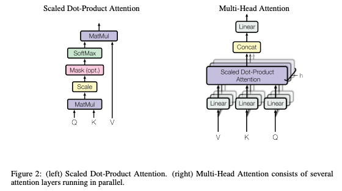

# Replication Project: Transformer-from-scratch

The goal of this project is to implement a transformer model from scratch and replicate the machine translation performance of [Attention is all you need](https://arxiv.org/pdf/1706.03762.pdf) paper. 

## Transformer model

Considering the model's universal popularity, I'll just brefiely describe its architecture. Transformer eschewing recurrence and rely entirely on an attention mechanism to draw global dependencies between input and output. It allows significantly more parralelization than RNN. 

### Model architecture


In my implementation, the module is divided into 4 big parts.

* Embedding
  * token embedding
  * positional encoding
* Encoder
  * Encoder layer
* Decoder
  * Decoder layer
* Classifier

### attention architecture



```python
    def calculate_attn(
            self, q: Tensor, k: Tensor, v: Tensor, mask: Tensor = None
    ) -> typing.Tuple[Tensor, Tensor]:
        """
        calculate scaled dot product attention

        :param q: torch.Tensor, shape: (batch_size * h, q_len, d_k)
        :param k: torch.Tensor, shape: (batch_size * h, k_len, d_k)
        :param v: torch.Tensor, shape: (batch_size * h, k_len, d_k)
        :param mask: torch.Tensor, shape: (batch_size * h, q_len, k_len)

        :return attn_out: torch.Tensor, shape: (batch_size * h, q_len, k_len)
        :return attn_score: torch.Tensor, shape: (batch_size * h, q_len, q_len)
        """

        # 1. scaling
        q = q / math.sqrt(self.d_k)

        # 2. QK^T
        attn_score = torch.bmm(q, k.transpose(-2, -1))  # shape: (batch_size * h, q_len, k_len)
        # (3. masking)
        if mask is not None:
            attn_score = attn_score.masked_fill(mask == 0, value=float("-inf"))

        # 4. softmax
        attn_score = F.softmax(attn_score, dim=-1)  # shape: (batch_size * h, q_len, k_len)

        # (dropout)
        # This is actually dropping out entire tokens to attend to, which might
        # seem a bit unusual, but is taken from the original Transformer paper.
        attn_score = self.dropout(attn_score)

        # 5. dot product with V
        attn_out = torch.bmm(attn_score, v)  # shape: (batch_size * h, q_len, d_k)

        return attn_out, attn_score
```

## Setup

```angular2html
pip install requirements.txt
pip install -e .
```

## Checklist

Before training, let's check if the baseline and my implementation have the same forward and backward pass.

- [x] Check the number of parameters
- [x] Check if output tensors are the same size
- [x] Check self/cross attention masks
  * In torch.transformer, masks are given as inputs. They have the different shape as my model. But checked if baseline masks can be made by reshaping my masks
- [x] Check model.state_dict()
  - [x] Check if the parameters has the same dimensions
- [x] Copy the weights and
  - [x] feed an input and check if the output is the same
    - [x] Without padding
      - [x] Precision issue - FIXED: change scaled dot product attention
    - [x] With padding
- [x] Call loss.backward() once and check if the gradients are the same for all parameters

* how to test

```angular2html
python ./tests/test_trainsformer.py
```

## Training 

* Task - Machine Translation
* Dataset - Multi30k
* Baseline model training logs

```
    Epoch: 1, Train loss: 4.487, Val loss: 3.824, Epoch time = 60.442s
    Epoch: 2, Train loss: 3.629, Val loss: 3.481, Epoch time = 57.315s
    Epoch: 3, Train loss: 3.318, Val loss: 3.261, Epoch time = 55.679s
    Epoch: 4, Train loss: 3.075, Val loss: 3.107, Epoch time = 52.929s
    Epoch: 5, Train loss: 2.871, Val loss: 2.953, Epoch time = 52.998s
    Epoch: 6, Train loss: 2.663, Val loss: 2.764, Epoch time = 52.787s
    Epoch: 7, Train loss: 2.426, Val loss: 2.615, Epoch time = 52.687s
    Epoch: 8, Train loss: 2.183, Val loss: 2.353, Epoch time = 54.114s
    Epoch: 9, Train loss: 1.957, Val loss: 2.218, Epoch time = 52.905s
    Epoch: 10, Train loss: 1.772, Val loss: 2.134, Epoch time = 52.933s
    Epoch: 11, Train loss: 1.622, Val loss: 2.097, Epoch time = 56.216s
    Epoch: 12, Train loss: 1.495, Val loss: 2.057, Epoch time = 52.930s
    Epoch: 13, Train loss: 1.389, Val loss: 2.056, Epoch time = 53.334s
    Epoch: 14, Train loss: 1.292, Val loss: 2.039, Epoch time = 52.807s
    Epoch: 15, Train loss: 1.208, Val loss: 2.052, Epoch time = 52.755s
```

* My model training logs

```
    Epoch: 1, Train loss: 4.870, Val loss: 4.093, Epoch time = 56.626s
    Epoch: 2, Train loss: 3.876, Val loss: 3.730, Epoch time = 56.522s
    Epoch: 3, Train loss: 3.583, Val loss: 3.519, Epoch time = 56.529s
    Epoch: 4, Train loss: 3.382, Val loss: 3.407, Epoch time = 59.857s
    Epoch: 5, Train loss: 3.213, Val loss: 3.305, Epoch time = 56.343s
    Epoch: 6, Train loss: 3.077, Val loss: 3.218, Epoch time = 56.429s
    Epoch: 7, Train loss: 2.960, Val loss: 3.123, Epoch time = 56.438s
    Epoch: 8, Train loss: 2.854, Val loss: 3.065, Epoch time = 66.608s
    Epoch: 9, Train loss: 2.754, Val loss: 3.006, Epoch time = 56.615s
    Epoch: 10, Train loss: 2.658, Val loss: 2.972, Epoch time = 56.588s
    Epoch: 11, Train loss: 2.566, Val loss: 2.927, Epoch time = 56.805s
    Epoch: 12, Train loss: 2.479, Val loss: 2.896, Epoch time = 56.729s
    Epoch: 13, Train loss: 2.401, Val loss: 2.844, Epoch time = 65.113s
    Epoch: 14, Train loss: 2.321, Val loss: 2.846, Epoch time = 56.403s
    Epoch: 15, Train loss: 2.246, Val loss: 2.825, Epoch time = 56.412s
```
