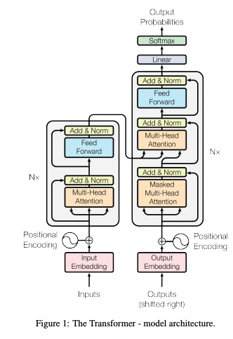

# Implementing Transformer from Scratch

---

The goal of this project is to implement a Transformer model from scratch, originally proposed in “[Attention is all you need](https://arxiv.org/pdf/1706.03762.pdf)” paper. Among lots of good implementations, I chose the PyTorch version `torch.nn.transformer` as the baseline. To be specific, my goal is to implement an identical model to the one in [this tutorial](https://pytorch.org/tutorials/beginner/translation_transformer.html). 

## Transformer basics

Given the model's popularity, I'll only provide a brief description of its architecture. Transformer makes use of the attention mechanism to draw global dependencies between input and output. It can achieve significantly more parallelization than RNN by avoiding recurrence with attention. The skeleton of the model is encoder-decoder architecture. The encoder maps an input sequence into continuous representations, which we refer to as memory. The decoder generates an output sequence based on memory.

### Model architecture



The model architecture is depicted in Figure 1 of the paper. It is divided into four major modules: embedding, encoder, decoder, and final classifier. 

- **Embedding**
    - Token embedding
    - Positional encoding
- **Encoder** (Stack of N identical encoder layers)
    - Encoder layer
        - Multi-head self-attention block
        - Feed-forward block
- **Decoder** (Stack of N identical encoder layers)
    - Decoder layer
        - Multi-head self-attention block
        - Multi-head cross-attention block
        - Feed-forward block
- **Final classifier**

In terms of implementation, we have four basic building blocks, which are depicted in different colors above. Each building block performs the following:

- Token embedding - Learned embeddings to convert input and output tokens to vectors with `d_model` dimensions.
- Positional encoding - Indicates the relative or absolute position of the tokens in the sequence, and is added element-wise to token embeddings.
- Multi-head attention block - Attention maps a query and a set of key-value pairs to an output. The multi-head attention block is made up of `h` parallel attention heads. Inputs and outputs for each attention head are `d_k = d model / h` dimensioned vectors.
- Feed-forward block - A fully connected feed-forward network composed of two linear transformations with a ReLU activation in between.

## My implementation

In my implementation, the embedding and final classifier are contained in `model/transformer.py`, while the encoder and decoder are contained in `model/encoder.py` and `model/decoder.py`, respectively. The basic building blocks mentioned above can be found in the `model/sublayer/` directory. This is how I organized my model implementation.

```bash
model
├── transformer.py
├── encoder.py
├── decoder.py
├── layer
│   ├── encoder_layer.py
│   └── decoder_layer.py
├── sublayer
│   ├── multihead_attention.py
│   ├── ffn_layer.py
│   ├── token_embedding.py
│   └── positional_encoding.py
```

### Scaled dot-product attention


Now, let's take a closer look at scaled dot-product attention, which is at the heart of the transformer model. Scaled dot-product attention takes query, key, and value as inputs. The output is computed as a weighted sum of the values, with the weight determined by the query and key.

My scaled dot-product attention method can be found in `model.sublayer.multihead_attention.MultiheadAttention` class. The query is a `batch_size * h, q_len, d_k` shaped tensor, and the key and value are also `batch_sizes * h, k_len, d_k` shaped tensors. The query can have different sequence lengths from the other two, but the key and value must have the same length. 

The code is as follows:

```python
def calculate_attn(
          self, q: Tensor, k: Tensor, v: Tensor, mask: Tensor = None
  ) -> typing.Tuple[Tensor, Tensor]:
      """
      calculate scaled dot product attention

      :param q: torch.Tensor, shape: (batch_size * h, q_len, d_k)
      :param k: torch.Tensor, shape: (batch_size * h, k_len, d_k)
      :param v: torch.Tensor, shape: (batch_size * h, k_len, d_k)
      :param mask: torch.Tensor, shape: (batch_size * h, q_len, k_len)

      :return attn_out: torch.Tensor, shape: (batch_size * h, q_len, k_len)
      :return attn_score: torch.Tensor, shape: (batch_size * h, q_len, q_len)
      """

      # 1. scaling
      q = q / math.sqrt(self.d_k)

      # 2. QK^T
      attn_score = torch.bmm(q, k.transpose(-2, -1))  # shape: (batch_size * h, q_len, k_len)
      # (3. masking)
      if mask is not None:
          attn_score = attn_score.masked_fill(mask == 0, value=float("-inf"))

      # 4. softmax
      attn_score = F.softmax(attn_score, dim=-1)  # shape: (batch_size * h, q_len, k_len)

      # (dropout)
      # This is actually dropping out entire tokens to attend to, which might
      # seem a bit unusual, but is taken from the original Transformer paper.
      attn_score = self.dropout(attn_score)

      # 5. dot product with V
      attn_out = torch.bmm(attn_score, v)  # shape: (batch_size * h, q_len, d_k)

      return attn_out, attn_score
```

## Baseline implementation

PyTorch transformer is the baseline I want to replicate. `torch.nn.modules.transformer` [module](https://pytorch.org/docs/stable/_modules/torch/nn/modules/transformer.html#Transformer) contains all model components except for the embedding layers. It's worth noting that its default configuration is `batch_first=False`, which means that the input shape is `(seq_len, batch_size, d_model)`, transposing the first and second dimensions of my implementation.

[Multihead attention block](https://pytorch.org/docs/stable/_modules/torch/nn/modules/activation.html#MultiheadAttention) is `torch.nn.activation.MultiheadAttention`, but actual forwarding occurs when calling `torch.nn.F.multi_head_attention_forward()` [function](https://github.com/pytorch/pytorch/blob/86c817cfa0cf9b87a4001a3ead3fc21b1a7b6c5a/torch/nn/functional.py#L5059). For scaled dot-product attention calculation, `torch.nn.F._scaled_dot_attention()` [function](https://github.com/pytorch/pytorch/blob/86c817cfa0cf9b87a4001a3ead3fc21b1a7b6c5a/torch/nn/functional.py#L4966) is similar to my `calculate_attn()` function above.

## M**odel verification**

Before we begin training, we need to make sure that my model has the same forward and backward path as the baseline. To do so, we created a list of model statistics and check if they are the same for the both models.

### **Checklist**

- [x]  The number of parameters
- [x]  Output tensor shape
- [x]  model.state_dict()
    - [x]  All the parameters have the same dimensions?
        - My implementation has three input projections layers (`nn.Linear(d_model, d_model)`) for each query, key, and value. On the other hand, baseline implementation uses concatenated weights shaped `(3 * d_model, d_model)` and assign it as a `nn.Parameter` instead of using `nn.Linear`. As a result, the sizes of `state_dict()` differ, and we need to manually match layer names to copy one to the other.
- [x]  Copy the weights and feed inputs
    - [x]  Outputs are the same?
        - [x]  Test an input without padding
        - [x]  Test an Input with padding
    - [x]  Attention masks
    - [x]  Attention scores
- [x]  Call loss.backward() once and check if the gradients are the same for all parameters